# 지질도의 3차원 분석

<details>
<summary>일러두기</summary>
본 문서의 파이썬 코드에는 이하의 구문이 생략되어 있습니다.

```python
# 최상단
import numpy as np
import matplotlib.pyplot as plt

plt.rcParams["figure.figsize"] = (10,10) 

# (코드 본문)

# 최하단
plt.show() 
# 또는
plt.savefig("filename.png")
```

이 외에도, 전에 등장했던 변수(`contour_values`, `strike_points`, etc.) 또는 함수(`parabola`, `fill_gaps`, etc.)는 이해를 해치지 않는 선에서 생략하였습니다.
</details>

## Ⅰ. 동기

지질도는 지형의 상태와 지층의 하부 구조를 쉽게 파악할 수 있도록 돕는다. 
하지만 지질도 분석은 초심자에게는 큰 난관으로 다가온다. 
처음 보는 입장에서는 지질도를 그리는 법도 알아야 하지만, 평면의 이미지를 다른 방향으로 회전 시켜 다시 단면 이미지를 얻는 것은 여간 쉬운 일이 아니기 때문이다.
이를 해결하기 위해, 평면 이미지인 지질도를 사람에게 익숙한 삼차원 이미지로 구현한다면 학습하는 입장에서 지질도를 더 쉽게 파악할 수 있겠다는 생각이 들어 본 주제를 계획하게 되었다.

## Ⅱ. 탐구
### 1) 목표

<p align="middle">
    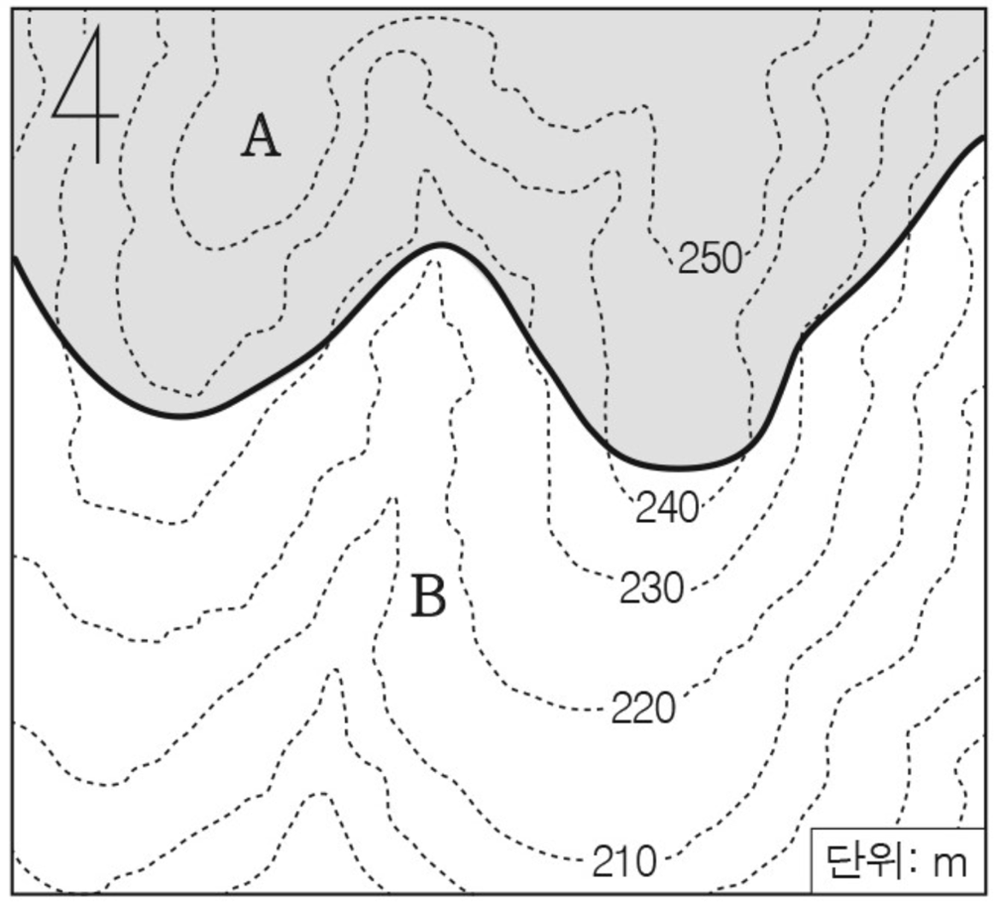
    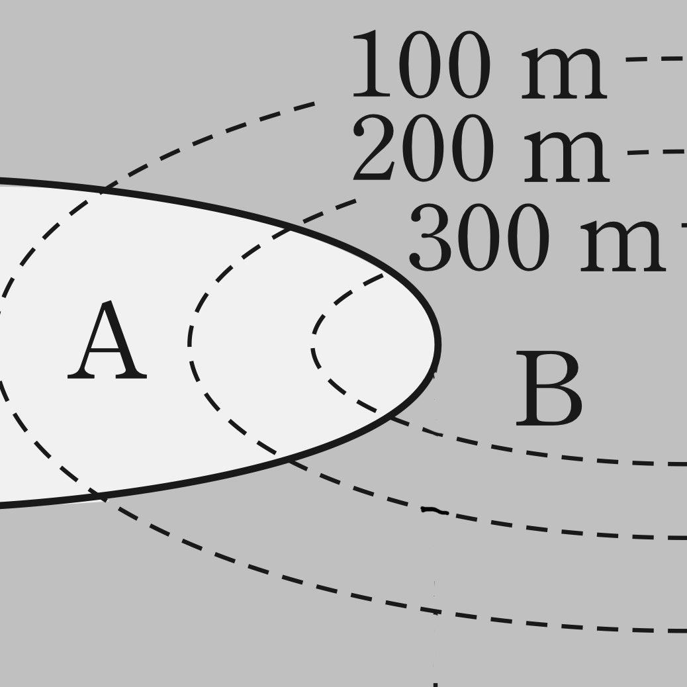
</p>

처음부터 왼쪽 그림과 같은 복잡한 개형의 등고선을 가진 지질도를 구현을 목표로 삼는다면, 진행 과정이 매우 복잡할 것이다.
그러므로, 2023 수능특강에 있는 오른쪽 그림(이하 ‘g2’)의 지질도를 삼차원으로 구현하는 것을 목표로 삼는다.

### 2) 방법 모색 및 사용하는 라이브러리
삼차원 모델로 만들기 위해서는, 평면의 이미지인 지질도에서 수치 데이터를 추출해야 한다. 
필요한 데이터는 두 가지 종류로, 등고선의 개형과 위치, 그리고 주향이다. 
데이터를 추출하는 방법은 두 가지다. 
첫 번째는 자동으로, OpenCV 등의 컴퓨터 비전 라이브러리를 사용하여 선의 위치와 개형을 인식하는 방법이 있다.
두 번째는 수동으로, 미리 특정 지질도의 등고선의 개형을 이차곡선 등의 식으로 근사하여 데이터를 직접 작성하는 방법이다.
먼저 첫 번째 방법을 시도해보자.

OpenCV(이하 ‘CV’)는 실시간 컴퓨터 비전(이미지 프로세싱)을 목적으로 하는 라이브러리다. (출처: OpenCV 공식 홈페이지) CV는 이미지 변환, 영상 실시간 변형 등의 작업을 수행할 수 있다.
본 탐구에서는 지질도에 있는 선을 인식하는 목적으로 사용할 것이다.
CV에서 선을 인식하려면, 먼저 이미지의 가장자리를 검출한 다음, 허프변환(직선의 방정식을 근사하는 방식)을 해야 한다.
가장자리를 검출하기 위해서는 이미지의 밝기가 급격하게 변하는 곳을 찾아야 하는데, 이를 위해 이미지를 미분한다.
미분 방식에는 여러 종류가 있는데, 이 중 가장 성능이 좋은 canny 연산을 사용한다.

<details>
<summary>코드 보기</summary>

```python
import cv2

src = cv2.imread("g2.png", cv2.IMREAD_COLOR)
gray = cv2.cvtColor(src, cv2.COLOR_BGR2GRAY)

canny = cv2.Canny(src, 100, 255)
imgLines = cv2.HoughLinesP(canny, 15, np.pi / 180, 10, minLineLength=10, maxLineGap=30)

for i in range(len(imgLines)):
    for x1, y1, x2, y2 in imgLines[i]:
        cv2.line(src, (x1, y1), (x2, y2), (0, 255, 0), 2)

cv2.imshow('canny', canny)
cv2.imshow('Final Image with dotted Lines detected', src)
cv2.waitKey()
cv2.destroyAllWindows()
```

</details>

<p align="middle">
    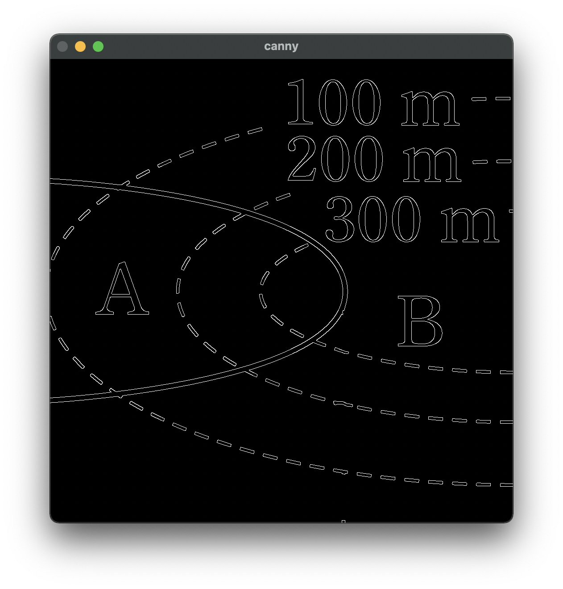
    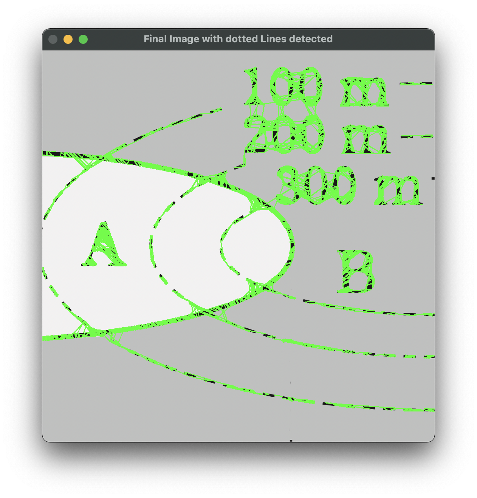
</p>

g2에 canny 연산을 수행하면 왼쪽 사진과 같다. 왼쪽 사진에 허프변환을 수행하면 오른쪽 사진과 같다. 

오른쪽 사진에서 거미줄처럼 빽빽하게 직선들이 그어진 모습을 확인할 수 있다.
결과물이 그리 만족스럽지 않은데, A, B, 100m, 200m, 300m 글자는 제거하면 될지 몰라도, 지질경계선과 등고선의 인식 결과가 매끄럽지 않다.
이 이유는 허프 변환은 위에서도 언급했듯이 직선의 방정식을 근사하여 사용하는 방식이기 때문에, 곡선을 인식하지 않는다.
곡선을 인식시키기 위해서는 머신러닝을 사용해야 하는데, 여러 데이터를 통해 학습시키기에는 시간이 부족하다.
따라서 CV로는 선을 인식하지 않는 방향으로 계획을 수정한다. 

그리하여 수동으로 등고선과 주향을 근사/입력하는 방향으로 탐구를 진행한다.
삼차원 이미지를 그리기 위해서 파이썬의 시각화 라이브러리인 `matplotlib`(이하 `plt`)을 사용한다. plt는 공학 계산기처럼 식을 입력받는 것이 아니라, 점 하나하나를 입력 받는다.
독립적인 점이 아니라 선을 나타내기 위해서는 무수히 많은 점이 필요하다.
이를 위해 행렬 계산에 사용되는 `numpy`(이하 `np`)를 사용한다.

### 3) 준비 및 계획

수동으로 지질도의 수치 데이터를 얻어보자. 
등고선의 곡선을 근사한다.
g2에서의 등고선은 첨점이 없는 곡선이다.
이차곡선 중 포물선과 유사하여 포물선을 곡선 식 근사에 이용한다.
g2 이미지 위에 곡선을 그려보며 식을 유추한다.
왼쪽 사진은 plt로 g2를 좌표평면 위에 띄운 것이고, 오른쪽의 코드로 g2 위에 포물선 세 개를 그린 모습이 가운데 사진이다.

<details>
<summary>코드 보기</summary>

```python
fig, ax = plt.subplots()
ax.set_xlim([0, 1036])
ax.set_ylim([0, 1036])

img = plt.imread("images/g2.png")
ax.imshow(img, extent=[0, 1036, 0, 1036])

contour_values = [
    # (p, x_start, height)
    (60, -10, 100),
    (40, 290, 200),
    (20, 470, 300),
]

def parabola(p, center_x, center_y, Y):
    X = center_x + (1 / (4 * p)) * ((Y - center_y) ** 2)
    return X

for v in contour_values:
    Y = np.arange(0, 1036, 0.5)
    X = parabola(v[0], v[1], 1036 / 2, Y)
    ax.scatter(X, Y, edgecolor="blue")
```

</details>


<p align="middle">
    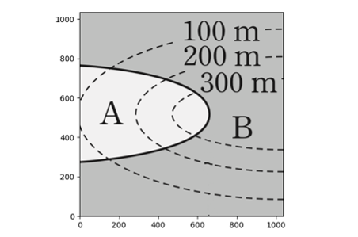
    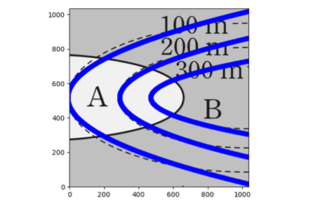
</p>

코드의 contour_values가 각 포물선의 꼭짓점의 위치와 p값이 저장된 튜플(배열의 일종)이다.
각 값은 비슷한 개형이 나올 때까지 수동으로 조정하였다. 

이제 주향의 위치를 입력한다.
주향은 등고선과 지질 경계선의 교점을 이은 선이므로, 교점의 위치를 찾으면 된다.
이미지의 어느 위치에 있는지 파악하기 위해서 Adobe Photoshop(이하 ‘PS’)을 사용한다.

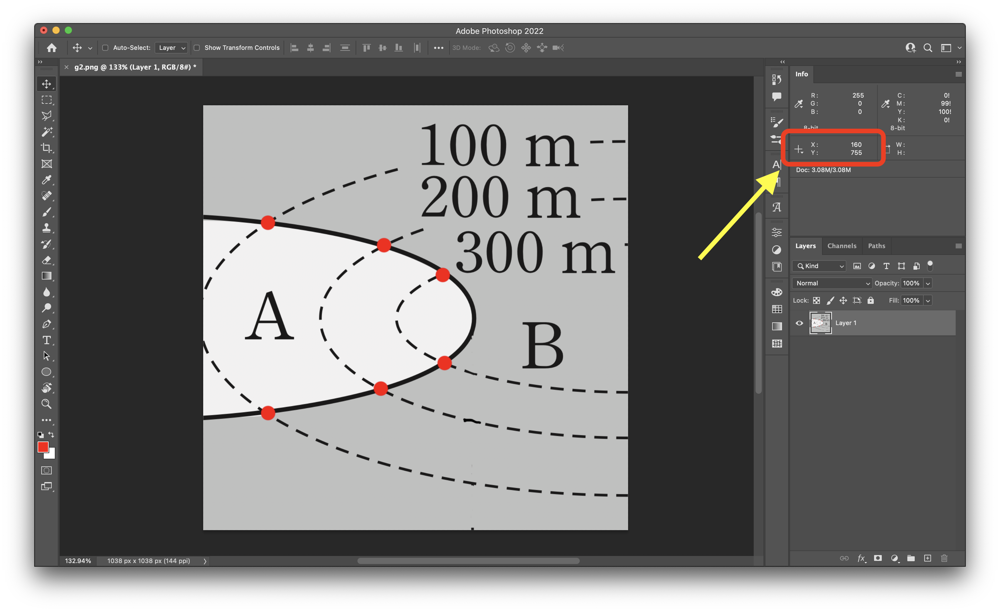

PS의 ‘Info’ 항목에서 현재 커서의 이미지 위의 위치를 확인할 수 있다(사진의 빨간 사각형 부분).
이렇게 총 6개의 점의 위치를 측정한다. g2에서 점의 위치는 다음과 같다. 

```python
strike_points = [
    # 100m
    ((157, 287, 100), (157, 749, 100)),
    # 200m
    ((443, 342, 200), (443, 694, 200)),
    # 300m
    ((592, 410, 300), (587, 628, 300)),
]
```

등고선별로 정리되어 있으며, 괄호는 `(x,y,z)`를 나타낸다.
z는 등고선의 고도로, 후에 삼차원 이미지를 위해 같이 작성하였다.

### 4) 구현1 - 지형 그리기
*3) 준비 및 계획*에서 얻은 등고선 포물선을 이용해 지형을 그려보자.
지금까지 이차원의 좌표평면을 보았다면, 이제는 삼차원의 좌표공간으로 넘어갈 차례다.
g2를 좌표공간의 xy평면 위에 겹쳐본다.

<details>
<summary>코드 보기</summary>

```python
fig, ax = plt.subplots(subplot_kw={"projection": "3d"})
ax.set_xlim([0, 1036])
ax.set_ylim([0, 1036])
ax.set_zlim([0, 500])

img = plt.imread("images/g2.png")
X, Y = np.ogrid[0:img.shape[0], 0:img.shape[1]] # open-grid 생성
img = img[-Y,X] # 이미지 회전
Z = np.zeros_like(X)
ax.plot_surface(X, Y, Z, rstride=5, cstride=5, facecolors=img)
```

</details>

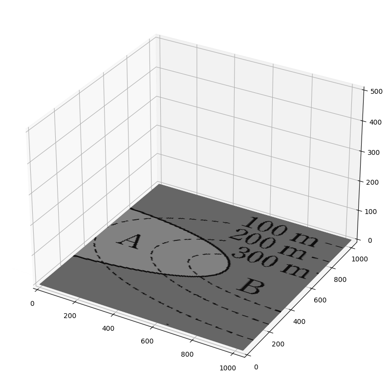

위에 등고선을 그린다. 전과는 다르게 높이가 존재하는 삼차원 공간이다.

<details>
<summary>코드 보기</summary>

```python
# 이전 코드에서 이어짐

for v in contour_values:
    Y = np.arange(0, 1036, 0.5)
    X = parabola(v[0], v[1], 1036 / 2, Y)
    Z = np.full((len(X)), v[2])
    ax.scatter(X, Y, Z, edgecolor="brown", alpha=0.5)
```

</details>


갈색으로 등고선이 높이에 맞게 생긴 것을 확인할 수 있다.
우리에게 필요한 것은 그저 등고선이 아닌, 산의 입체이므로 등고선을 이어서 산의 겉면을 만든다.
등고선을 그리기 위해 생성한 각 포물선 위의 점들을 같은 순서끼리 이어서 직선을 그린다.

<p align="middle">
    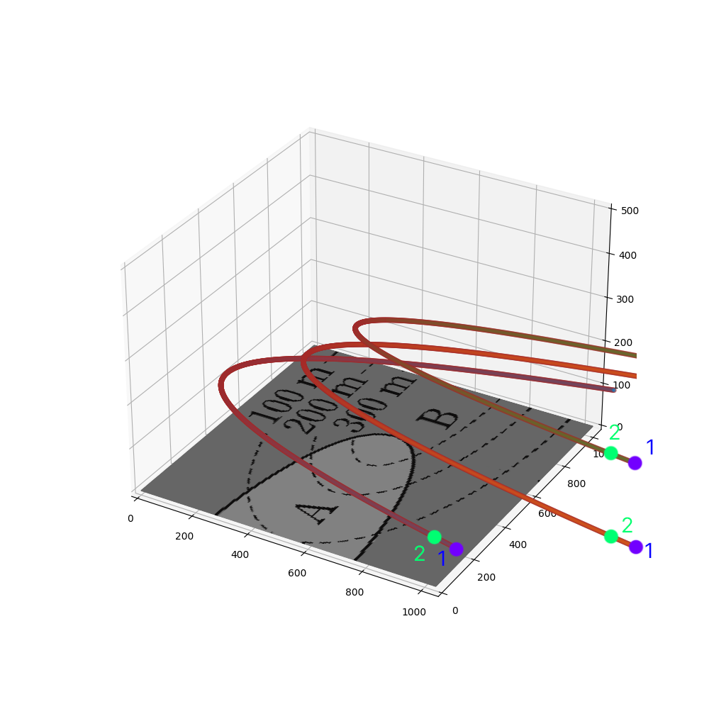
    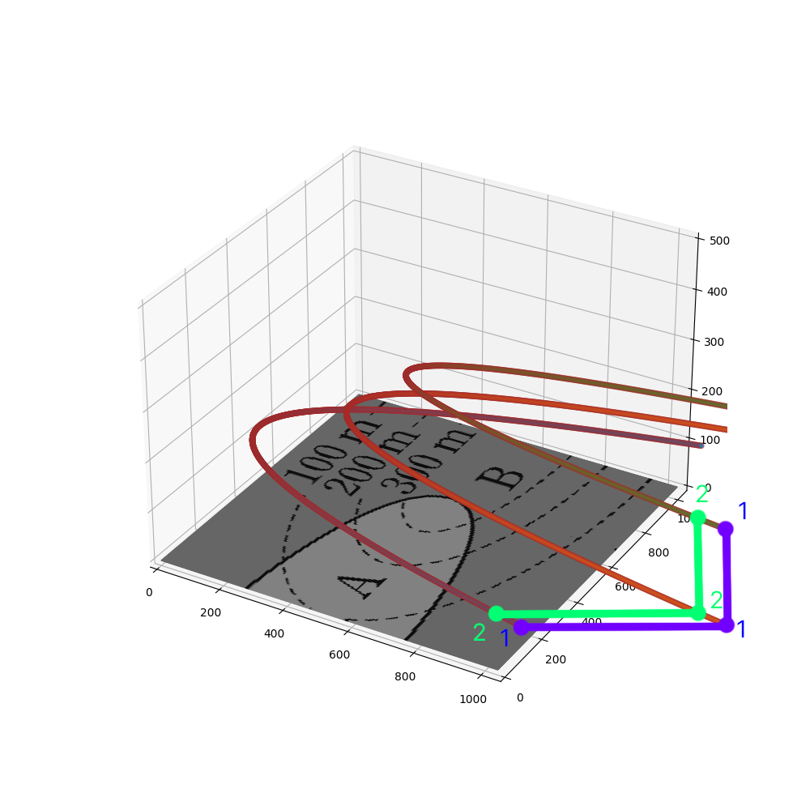
</p>

각 포물선 위에는 같은 개수의 점들이 있는데, 
100m 등고선의 1번째 점과 200m 등고선의 1번째 점을 서로 이어 직선을 그린 다음,
200m 등고선의 1번째 점과 300m 등고선의 1번째 점을 다시 이어 또다른 직선을 만든다. (왼쪽 사진)
2번째 점들도 똑같이 이어 두 개의 직선을 더 만든다. 그렇게 n번째 점들도 서로 서로 잇는다. (오른쪽 사진)

직접 구현해보면 아래와 같다.

<details>
<summary>코드 보기</summary>

```python
# 이전 이전 코드에서 이어짐
XYZ = []

# 이전 코드에서 이어짐
    XYZs.append((X, Y, Z))

for n in range(len(XYZs) - 1):
    for i in range(len(XYZs[n][0])):  # 점의 개수
        XYZ = []
        for axis in range(3): # X, Y, Z만큼 반복(=3번 반복)
            element = np.linspace(XYZs[n][axis][i], XYZs[n + 1][axis][i], 50) # 전달받은 구간 사이에 50개의 점을 생성
            XYZ.append(element)
        X, Y, Z = tuple(XYZ)
        Y = np.full((len(X)), XYZs[n][1][i])
        ax.scatter(X, Y, Z, edgecolor="brown", alpha=0.5)

```

</details>

<p align="middle">
    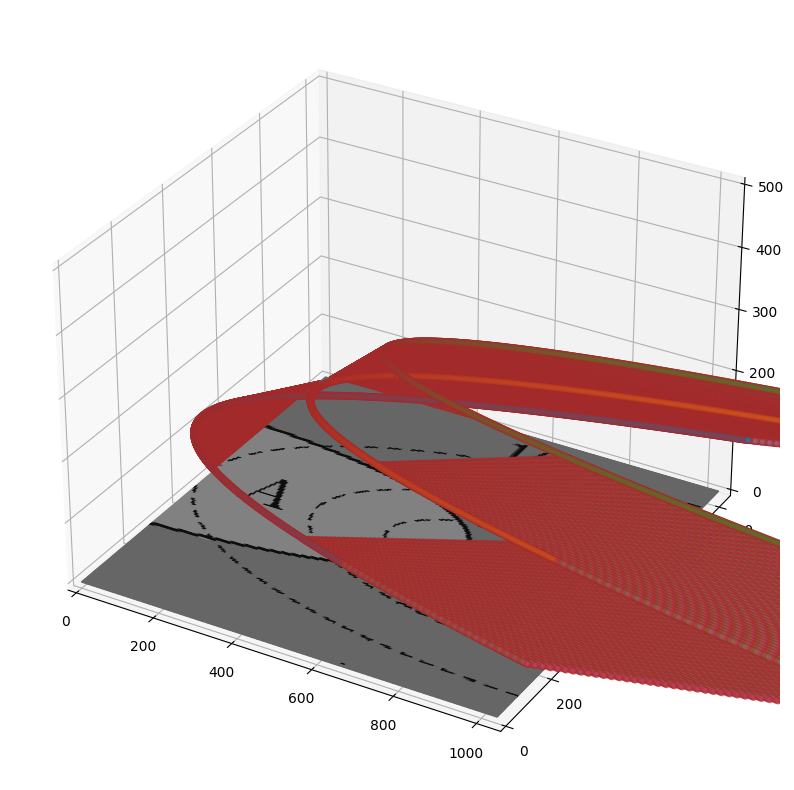
    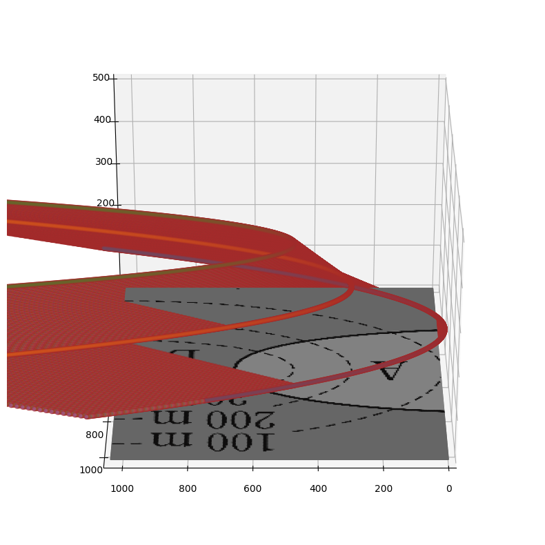
    
    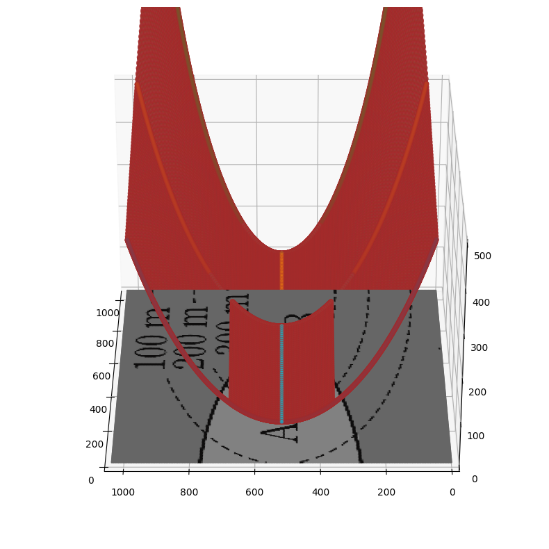
</p>

plt의 한계인지 구현 방식이 매끄럽지 않아서 그런지 바라보는 각도에 따라 생략되는 부분이 보인다. 360도 회전시킨 gif 이미지는 아래와 같다.


### 5) 구현2 - 지질 경계면 그리기

지질 경계면을 그리기 위해서는 먼저 주향을 표시한다. 위에서 구한 `strike_points`를 같은 고도의 점끼리 이으면 주향이 된다.

<details>
<summary>코드 보기</summary>

```python
# 이전 코드에서 이어짐

for same_altitudes in strike_points:
    XYZ = []
    A, B = same_altitudes
    for axis in range(3):
        element = np.linspace(A[axis], B[axis], 50)
        XYZ.append(element)
    X, Y, Z = tuple(XYZ)
    ax.scatter(X, Y, Z, edgecolor="blue")
```

</details>

<p align="middle">
    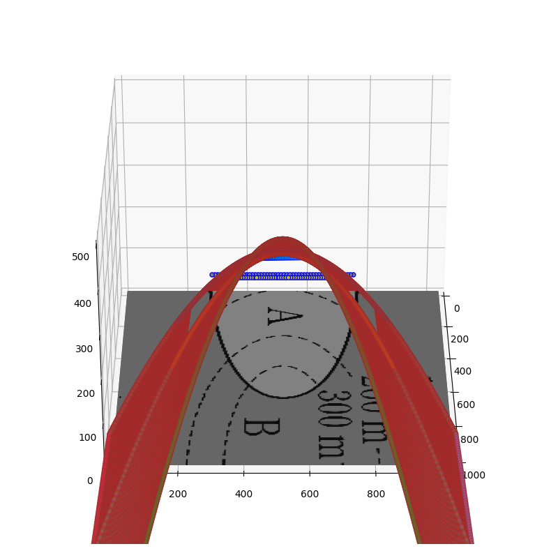
    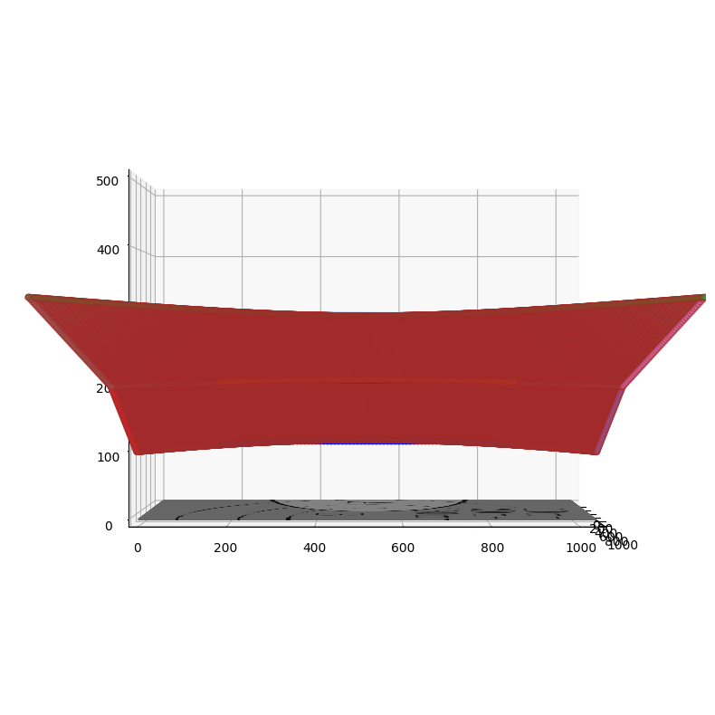
    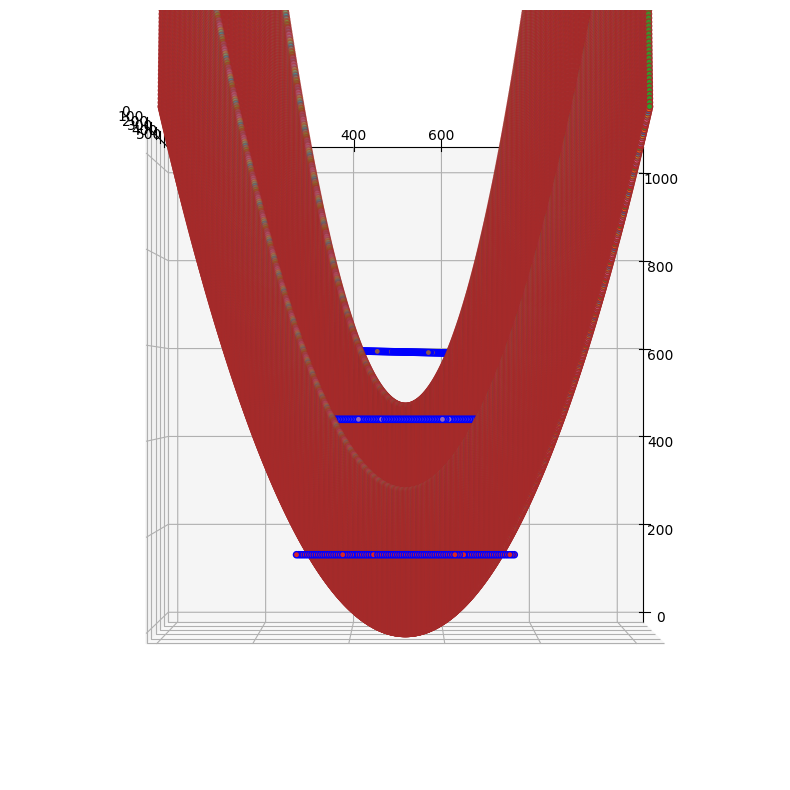
</p>

주향까지 그렸으니, 삼차원 이미지에 집중하기 위해서 이제 g2는 제거한다.

위에서 등고선의 점 하나하나끼리를 직선으로 이었던 것처럼, 주향 위의 점들도 하나하나 이어보자.
똑같은 액션이니 새로운 함수를 만든다.

```python
def fill_gap(ax, color, XYZs):
    for n in range(len(XYZs) - 1):
        for i in range(len(XYZs[n][0])):  # 점의 개수
            XYZ = []
            for axis in range(3):
                element = np.linspace(XYZs[n][axis][i], XYZs[n + 1][axis][i], 50)
                XYZ.append(element)
            X, Y, Z = tuple(XYZ)
            ax.scatter(X, Y, Z, edgecolor=color)
```

`fill_gap` 함수를 이용해 주향끼리 이어 지질경계면을 만들자.

```python
fill_gap(ax, "blue", XYZs)
```

<p align="middle">
    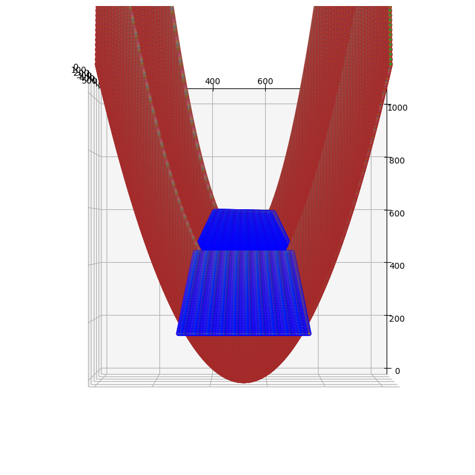
    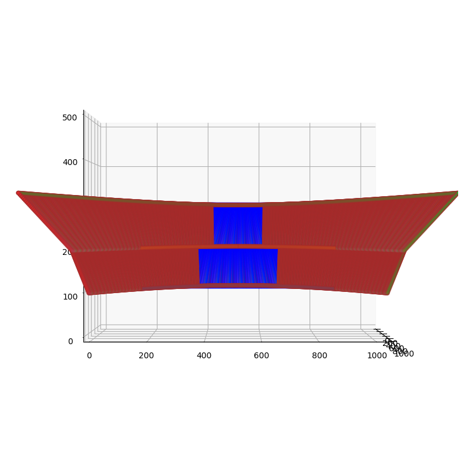
    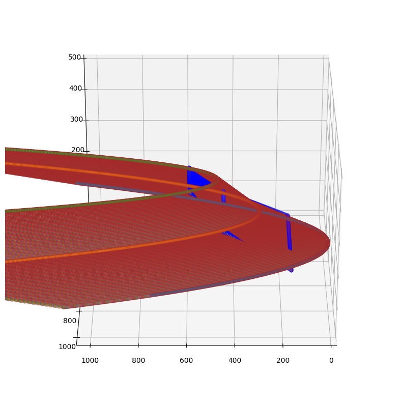
    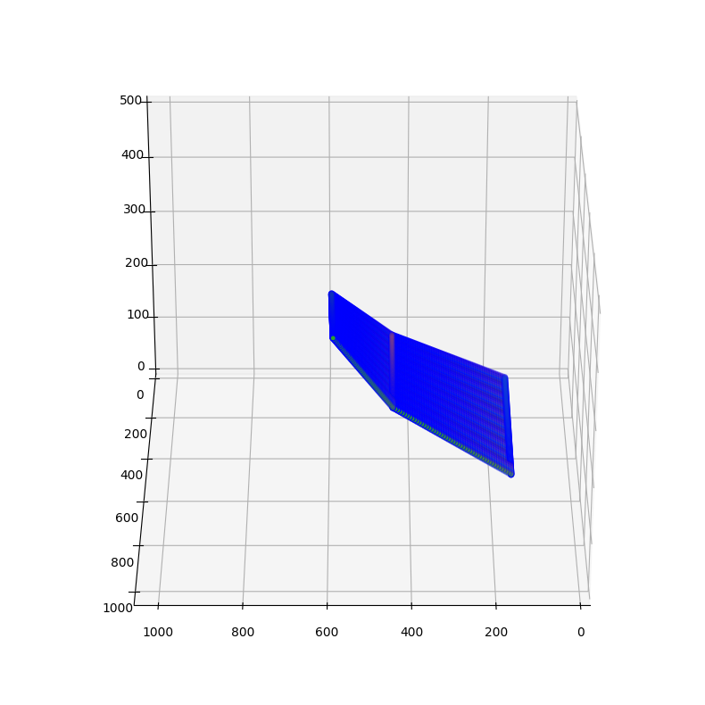
</p>

이렇게 g2의 삼차원 지형은 완성이다. 360도 회전하는 모습을 구경할 시간이다.


### 6) 구현3 - 지질단면도 얻기

삼차원 이미지의 장점은, 내가 원하는 각도나 위치를 마음대로 볼 수 있고, 마음대로 단면을 잘라서 볼 수 있다는 것이다.


## Ⅲ. 결론 및 느낀 점
