# 지질도의 3차원 분석

**이미지가 매우 많습니다. 로딩에 시간이 걸릴 수 있습니다. 빈 네모칸으로만 보인다면, 새로고침 해주세요.**

Table of Contents
=================

* [지질도의 3차원 분석](#지질도의-3차원-분석)
   * [Ⅰ. 동기](#ⅰ-동기)
   * [Ⅱ. 탐구](#ⅱ-탐구)
      * [1) 목표](#1-목표)
      * [2) 방법 모색 및 사용하는 라이브러리](#2-방법-모색-및-사용하는-라이브러리)
      * [3) 준비 및 계획](#3-준비-및-계획)
      * [4) 구현1 - 지형 그리기](#4-구현1---지형-그리기)
      * [5) 구현2 - 지질 경계면 그리기](#5-구현2---지질-경계면-그리기)
      * [6) 구현3 - 지질단면도 얻기](#6-구현3---지질단면도-얻기)
   * [Ⅲ. 느낀 점](#ⅲ-느낀-점)

<details>
<summary>(펼치기) 일러두기</summary>
본 문서의 파이썬 코드에는 이하의 구문이 생략되어 있습니다.

```python
# 최상단
import numpy as np
import matplotlib.pyplot as plt

plt.rcParams["figure.figsize"] = (10,10) 

# (코드 본문)

# 최하단
plt.show() 
# 또는
plt.savefig("filename.png")
```

이 외에도, 전에 등장했던 변수(`contour_values`, `strike_points`, etc.) 또는 함수(`parabola`, `fill_gaps`, etc.)는 이해를 해치지 않는 선에서 생략하였습니다.

자세한 코드는 `src/` 디렉터리를 참고하세요.
</details>

## Ⅰ. 동기

지질도는 지형의 상태와 지층의 하부 구조를 쉽게 파악할 수 있도록 돕는다. 
하지만 지질도 분석은 초심자에게는 큰 난관으로 다가온다. 
처음 보는 입장에서는 지질도를 그리는 법도 알아야 하지만, 평면의 이미지를 다른 방향으로 회전 시켜 다시 단면 이미지를 얻는 것은 여간 쉬운 일이 아니기 때문이다.
이를 해결하기 위해, 평면 이미지인 지질도를 사람에게 익숙한 삼차원 이미지로 구현한다면 학습하는 입장에서 지질도를 더 쉽게 파악할 수 있겠다는 생각이 들어 본 주제를 계획하게 되었다.

## Ⅱ. 탐구
### 1) 목표

<p align="middle">
    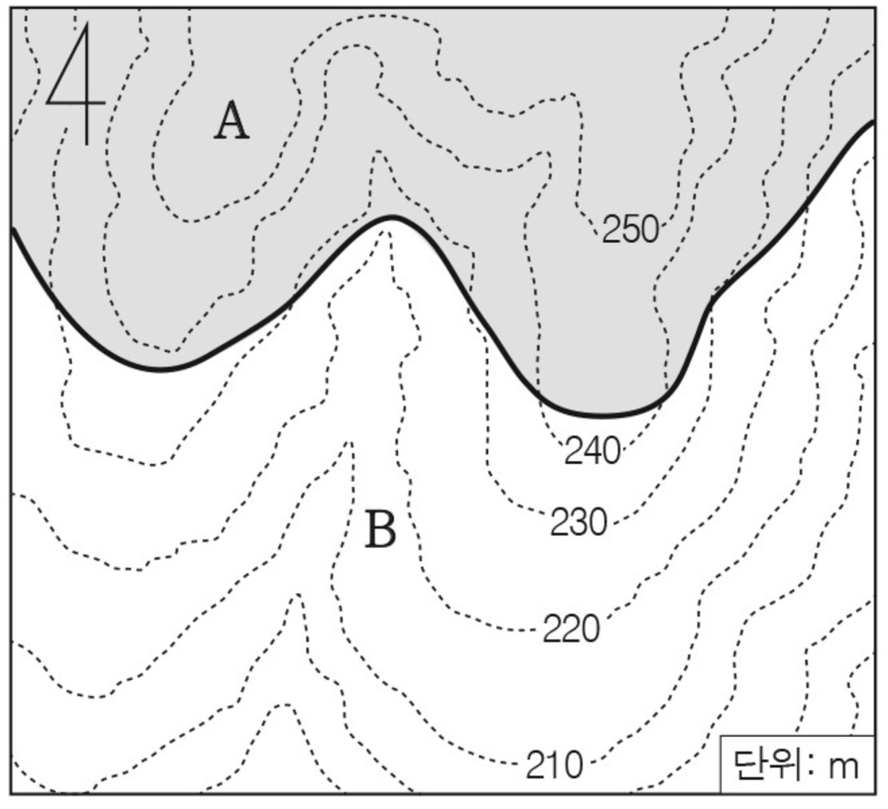
    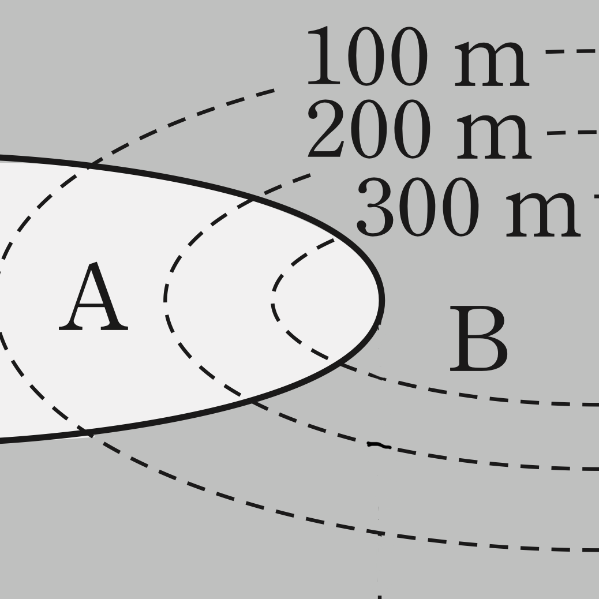
</p>

처음부터 왼쪽 그림과 같은 복잡한 개형의 등고선을 가진 지질도를 구현을 목표로 삼는다면, 진행 과정이 매우 복잡할 것이다.
그러므로, 2023 수능특강에 있는 오른쪽 그림(이하 ‘g2’)의 지질도를 삼차원으로 구현하는 것을 목표로 삼는다.

### 2) 방법 모색 및 사용하는 라이브러리
삼차원 모델로 만들기 위해서는, 평면의 이미지인 지질도에서 수치 데이터를 추출해야 한다. 
필요한 데이터는 두 가지 종류로, 등고선의 개형과 위치, 그리고 주향이다. 
데이터를 추출하는 방법은 두 가지다. 
첫 번째는 자동으로, OpenCV 등의 컴퓨터 비전 라이브러리를 사용하여 선의 위치와 개형을 인식하는 방법이 있다.
두 번째는 수동으로, 미리 특정 지질도의 등고선의 개형을 이차곡선 등의 식으로 근사하여 데이터를 직접 작성하는 방법이다.
먼저 첫 번째 방법을 시도해보자.

OpenCV(이하 ‘CV’)는 실시간 컴퓨터 비전(이미지 프로세싱)을 목적으로 하는 라이브러리다. (출처: OpenCV 공식 홈페이지) CV는 이미지 변환, 영상 실시간 변형 등의 작업을 수행할 수 있다.
본 탐구에서는 지질도에 있는 선을 인식하는 목적으로 사용할 것이다.
CV에서 선을 인식하려면, 먼저 이미지의 가장자리를 검출한 다음, 허프변환(직선의 방정식을 근사하는 방식)을 해야 한다.
가장자리를 검출하기 위해서는 이미지의 밝기가 급격하게 변하는 곳을 찾아야 하는데, 이를 위해 이미지를 미분한다.
미분 방식에는 여러 종류가 있는데, 이 중 가장 성능이 좋은 canny 연산을 사용한다.

<details>
<summary>(펼치기) 코드 보기</summary>

```python
import cv2

src = cv2.imread("g2.png", cv2.IMREAD_COLOR)
gray = cv2.cvtColor(src, cv2.COLOR_BGR2GRAY)

canny = cv2.Canny(src, 100, 255)
imgLines = cv2.HoughLinesP(canny, 15, np.pi / 180, 10, minLineLength=10, maxLineGap=30)

for i in range(len(imgLines)):
    for x1, y1, x2, y2 in imgLines[i]:
        cv2.line(src, (x1, y1), (x2, y2), (0, 255, 0), 2)

cv2.imshow('canny', canny)
cv2.imshow('Final Image with dotted Lines detected', src)
cv2.waitKey()
cv2.destroyAllWindows()
```

</details>

<p align="middle">
    
    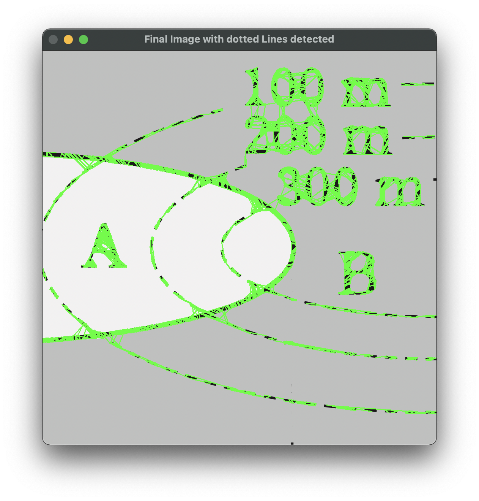
</p>

g2에 canny 연산을 수행하면 왼쪽 사진과 같다. 왼쪽 사진에 허프변환을 수행하면 오른쪽 사진과 같다. 

오른쪽 사진에서 거미줄처럼 빽빽하게 직선들이 그어진 모습을 확인할 수 있다.
결과물이 그리 만족스럽지 않은데, A, B, 100m, 200m, 300m 글자는 제거하면 될지 몰라도, 지질경계선과 등고선의 인식 결과가 매끄럽지 않다.
이 이유는 허프 변환은 위에서도 언급했듯이 직선의 방정식을 근사하여 사용하는 방식이기 때문에, 곡선을 인식하지 않는다.
곡선을 인식시키기 위해서는 머신러닝을 사용해야 하는데, 여러 데이터를 통해 학습시키기에는 시간이 부족하다.
따라서 CV로는 선을 인식하지 않는 방향으로 계획을 수정한다. 

그리하여 수동으로 등고선과 주향을 근사/입력하는 방향으로 탐구를 진행한다.
삼차원 이미지를 그리기 위해서 파이썬의 시각화 라이브러리인 `matplotlib`(이하 `plt`)을 사용한다. plt는 공학 계산기처럼 식을 입력받는 것이 아니라, 점 하나하나를 입력 받는다.
독립적인 점이 아니라 선을 나타내기 위해서는 무수히 많은 점이 필요하다.
이를 위해 행렬 계산에 사용되는 `numpy`(이하 `np`)를 사용한다.

### 3) 준비 및 계획

수동으로 지질도의 수치 데이터를 얻어보자. 
등고선의 곡선을 근사한다.
g2에서의 등고선은 첨점이 없는 곡선이다.
이차곡선 중 포물선과 유사하여 포물선을 곡선 식 근사에 이용한다.
g2 이미지 위에 곡선을 그려보며 식을 유추한다.
왼쪽 사진은 plt로 g2를 좌표평면 위에 띄운 것이고, 오른쪽의 코드로 g2 위에 포물선 세 개를 그린 모습이 가운데 사진이다.

<details>
<summary>(펼치기) 코드 보기</summary>

```python
fig, ax = plt.subplots()
ax.set_xlim([0, 1036])
ax.set_ylim([0, 1036])

img = plt.imread("images/g2.png")
ax.imshow(img, extent=[0, 1036, 0, 1036])

contour_values = [
    # (p, x_start, height)
    (60, -10, 100),
    (40, 290, 200),
    (20, 470, 300),
]

def parabola(p, center_x, center_y, Y):
    X = center_x + (1 / (4 * p)) * ((Y - center_y) ** 2)
    return X

for v in contour_values:
    Y = np.arange(0, 1036, 0.5)
    X = parabola(v[0], v[1], 1036 / 2, Y)
    ax.scatter(X, Y, edgecolor="blue")
```

</details>


<p align="middle">
    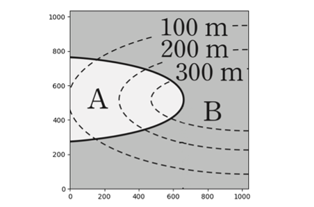
    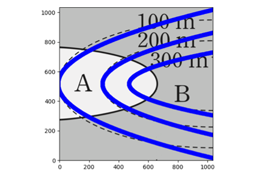
</p>

코드의 contour_values가 각 포물선의 꼭짓점의 위치와 p값이 저장된 튜플(배열의 일종)이다.
각 값은 비슷한 개형이 나올 때까지 수동으로 조정하였다. 

이제 주향의 위치를 입력한다.
주향은 등고선과 지질 경계선의 교점을 이은 선이므로, 교점의 위치를 찾으면 된다.
이미지의 어느 위치에 있는지 파악하기 위해서 Adobe Photoshop(이하 ‘PS’)을 사용한다.

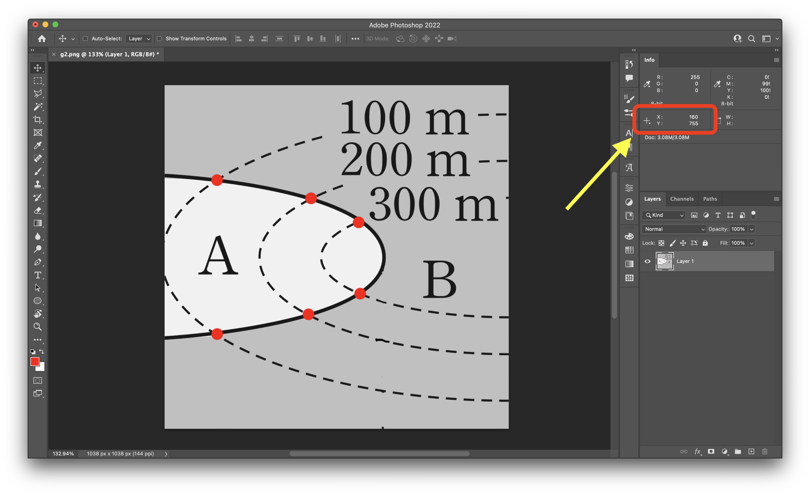

PS의 ‘Info’ 항목에서 현재 커서의 이미지 위의 위치를 확인할 수 있다(사진의 빨간 사각형 부분).
이렇게 총 6개의 점의 위치를 측정한다. g2에서 점의 위치는 다음과 같다. 

```python
strike_points = [
    # 100m
    ((157, 287, 100), (157, 749, 100)),
    # 200m
    ((443, 342, 200), (443, 694, 200)),
    # 300m
    ((592, 410, 300), (587, 628, 300)),
]
```

등고선별로 정리되어 있으며, 괄호는 `(x,y,z)`를 나타낸다.
z는 등고선의 고도로, 후에 삼차원 이미지를 위해 같이 작성하였다.

### 4) 구현1 - 지형 그리기
*3) 준비 및 계획*에서 얻은 등고선 포물선을 이용해 지형을 그려보자.
지금까지 이차원의 좌표평면을 보았다면, 이제는 삼차원의 좌표공간으로 넘어갈 차례다.
g2를 좌표공간의 xy평면 위에 겹쳐본다.

<details>
<summary>(펼치기) 코드 보기</summary>

```python
fig, ax = plt.subplots(subplot_kw={"projection": "3d"})
ax.set_xlim([0, 1036])
ax.set_ylim([0, 1036])
ax.set_zlim([0, 500])

img = plt.imread("images/g2.png")
X, Y = np.ogrid[0:img.shape[0], 0:img.shape[1]] # open-grid 생성
img = img[-Y,X] # 이미지 회전
Z = np.zeros_like(X)
ax.plot_surface(X, Y, Z, rstride=5, cstride=5, facecolors=img)
```

</details>

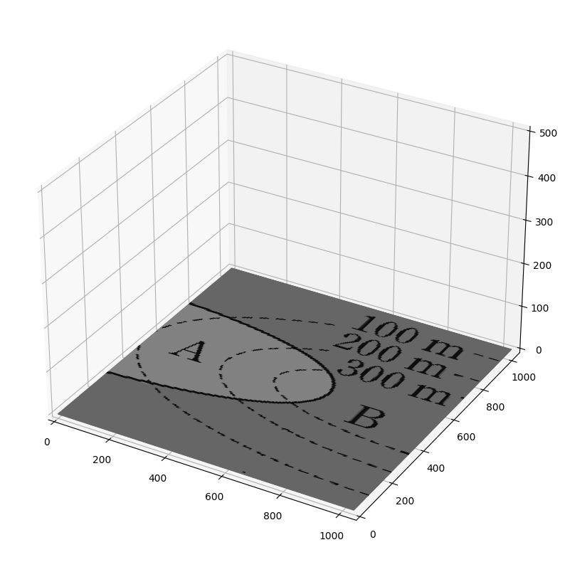

위에 등고선을 그린다. 전과는 다르게 높이가 존재하는 삼차원 공간이다.

<details>
<summary>(펼치기) 코드 보기</summary>

```python
# 이전 코드에서 이어짐

for v in contour_values:
    Y = np.arange(0, 1036, 0.5)
    X = parabola(v[0], v[1], 1036 / 2, Y)
    Z = np.full((len(X)), v[2])
    ax.scatter(X, Y, Z, edgecolor="brown", alpha=0.5)
```

</details>

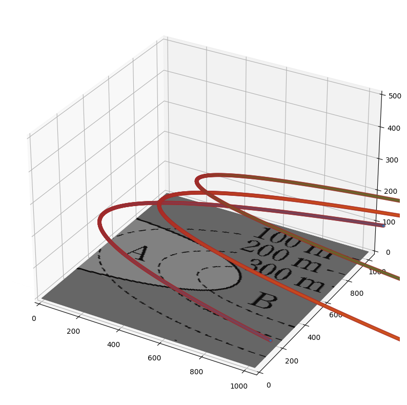

갈색으로 등고선이 높이에 맞게 생긴 것을 확인할 수 있다.
우리에게 필요한 것은 그저 등고선이 아닌, 산의 입체이므로 등고선을 이어서 산의 겉면을 만든다.
등고선을 그리기 위해 생성한 각 포물선 위의 점들을 같은 순서끼리 이어서 직선을 그린다.

<p align="middle">
    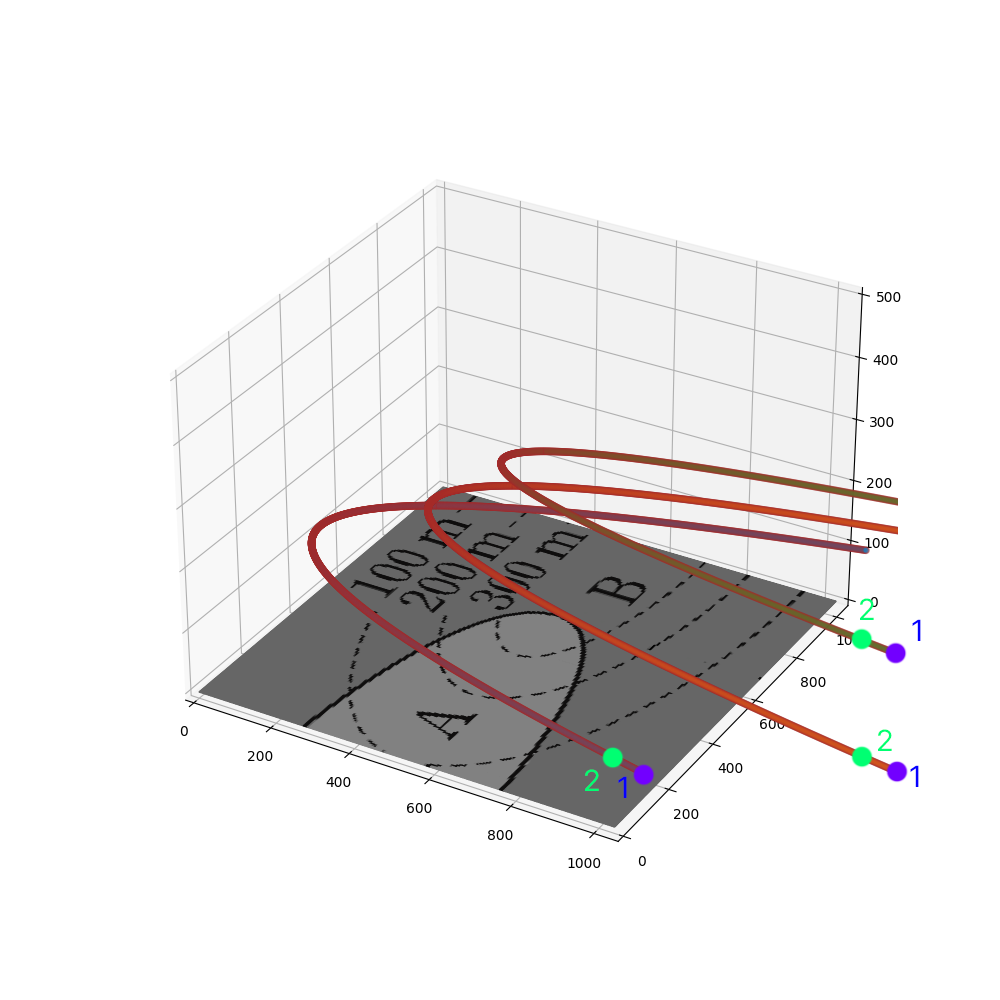
    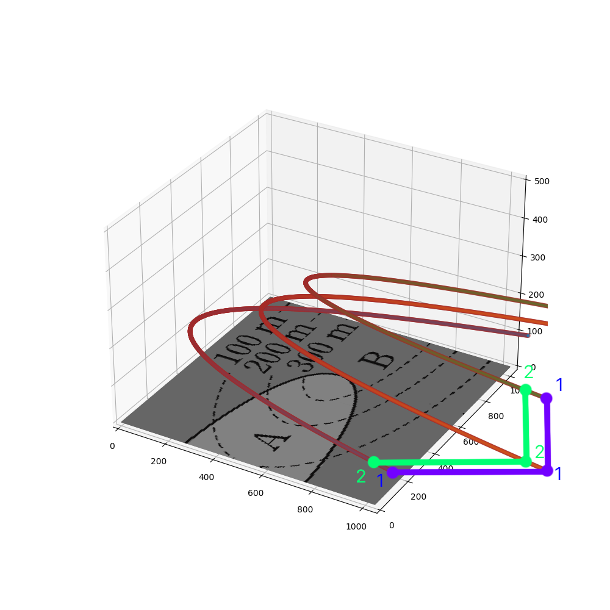
</p>

각 포물선 위에는 같은 개수의 점들이 있는데, 
100m 등고선의 1번째 점과 200m 등고선의 1번째 점을 서로 이어 직선을 그린 다음,
200m 등고선의 1번째 점과 300m 등고선의 1번째 점을 다시 이어 또다른 직선을 만든다. (왼쪽 사진)
2번째 점들도 똑같이 이어 두 개의 직선을 더 만든다. 그렇게 n번째 점들도 서로 서로 잇는다. (오른쪽 사진)

직접 구현해보면 아래와 같다.

<details>
<summary>(펼치기) 코드 보기</summary>

```python
# 이전 이전 코드에서 이어짐
XYZ = []

# 이전 코드에서 이어짐
    XYZs.append((X, Y, Z))

for n in range(len(XYZs) - 1):
    for i in range(len(XYZs[n][0])):  # 점의 개수
        XYZ = []
        for axis in range(3): # X, Y, Z만큼 반복(=3번 반복)
            element = np.linspace(XYZs[n][axis][i], XYZs[n + 1][axis][i], 50) # 전달받은 구간 사이에 50개의 점을 생성
            XYZ.append(element)
        X, Y, Z = tuple(XYZ)
        Y = np.full((len(X)), XYZs[n][1][i])
        ax.scatter(X, Y, Z, edgecolor="brown", alpha=0.5)

```

</details>

<p align="middle">
    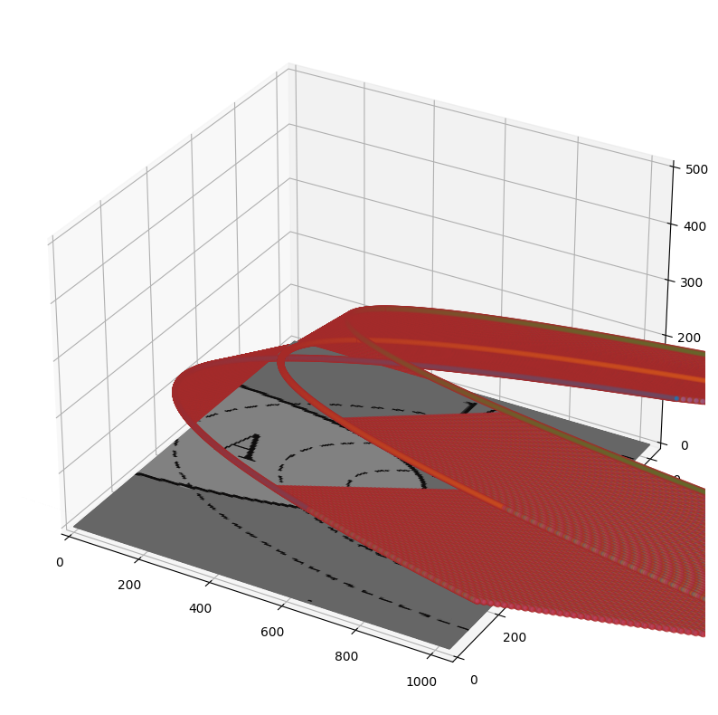
    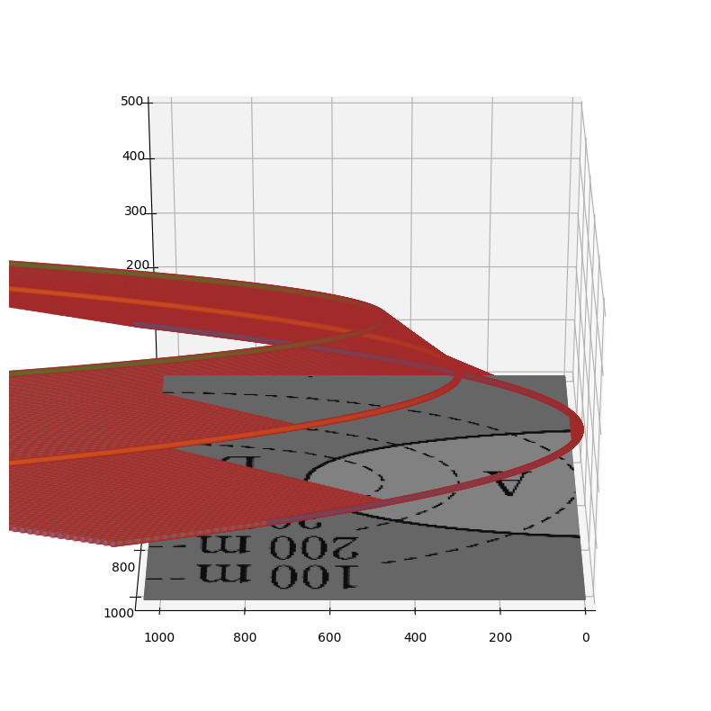
    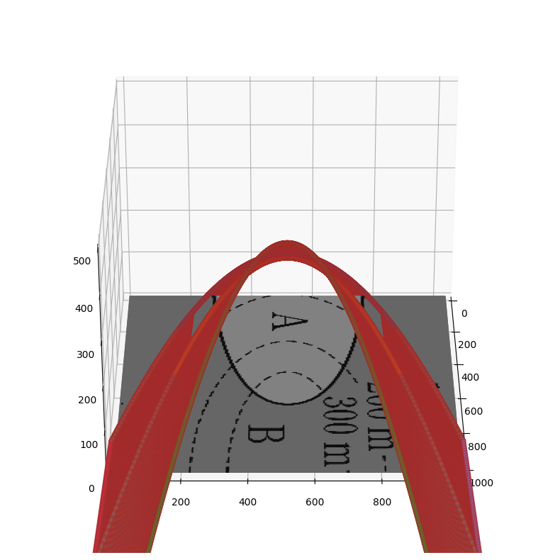
    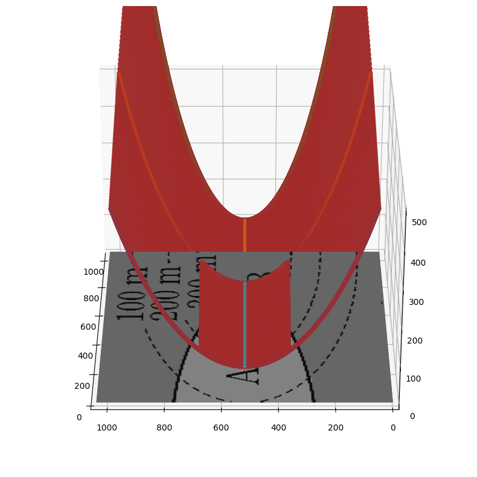
</p>

plt의 한계인지 구현 방식이 매끄럽지 않아서 그런지 바라보는 각도에 따라 생략되는 부분이 보인다. 360도 회전시킨 gif 이미지는 아래와 같다.


### 5) 구현2 - 지질 경계면 그리기

지질 경계면을 그리기 위해서는 먼저 주향을 표시한다. 위에서 구한 `strike_points`를 같은 고도의 점끼리 이으면 주향이 된다.

<details>
<summary>(펼치기) 코드 보기</summary>

```python
# 이전 코드에서 이어짐

for same_altitudes in strike_points:
    XYZ = []
    A, B = same_altitudes
    for axis in range(3):
        element = np.linspace(A[axis], B[axis], 50)
        XYZ.append(element)
    X, Y, Z = tuple(XYZ)
    ax.scatter(X, Y, Z, edgecolor="blue")
```

</details>

<p align="middle">
    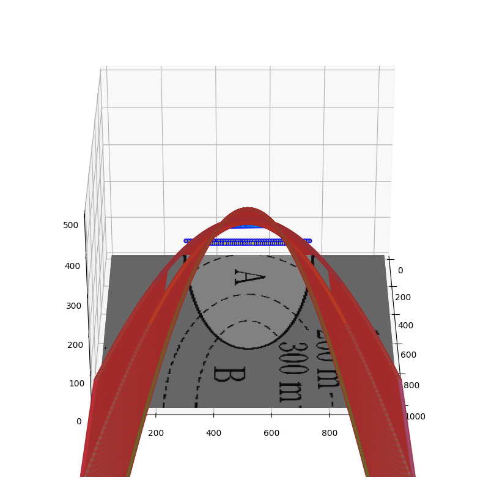
    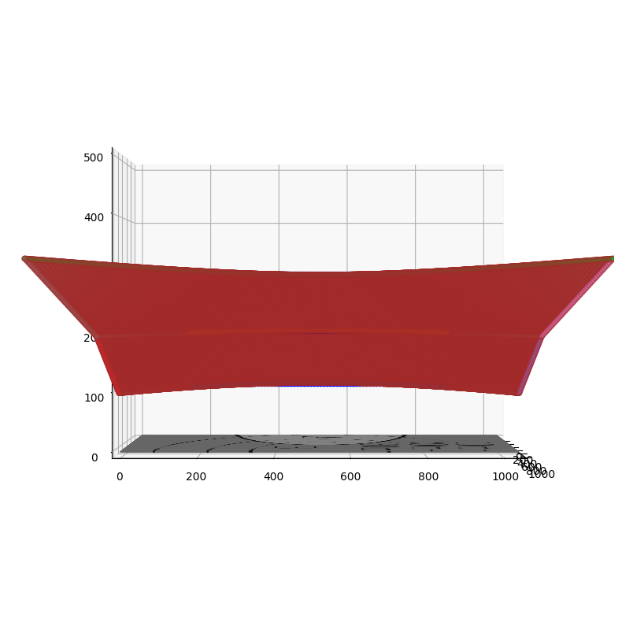
    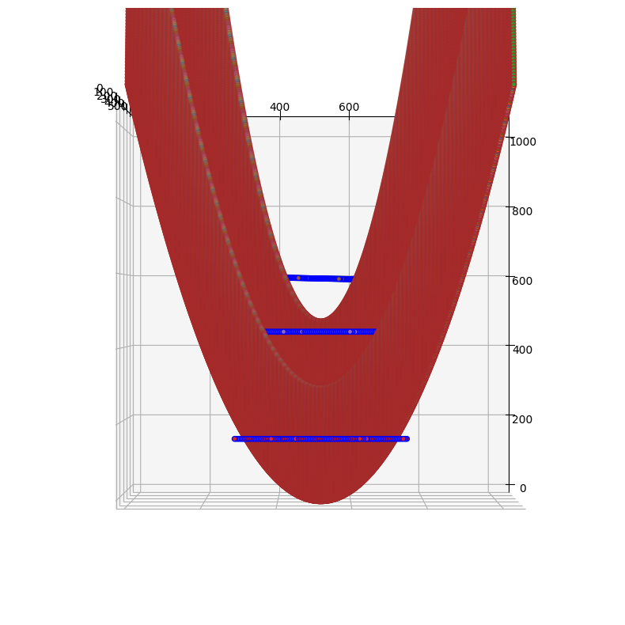
</p>

주향까지 그렸으니, 삼차원 이미지에 집중하기 위해서 이제 g2는 제거한다.

위에서 등고선의 점 하나하나끼리를 직선으로 이었던 것처럼, 주향 위의 점들도 하나하나 이어보자.
똑같은 액션이니 새로운 함수를 만든다.

```python
def fill_gap(ax, color, XYZs):
    for n in range(len(XYZs) - 1):
        for i in range(len(XYZs[n][0])):  # 점의 개수
            XYZ = []
            for axis in range(3):
                element = np.linspace(XYZs[n][axis][i], XYZs[n + 1][axis][i], 50)
                XYZ.append(element)
            X, Y, Z = tuple(XYZ)
            ax.scatter(X, Y, Z, edgecolor=color)
```

`fill_gap` 함수를 이용해 주향끼리 이어 지질경계면을 만들자.

```python
fill_gap(ax, "blue", XYZs)
```

<p align="middle">
    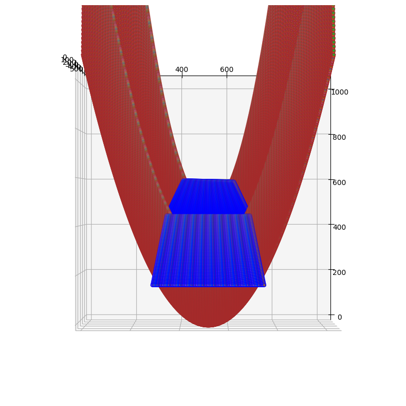
    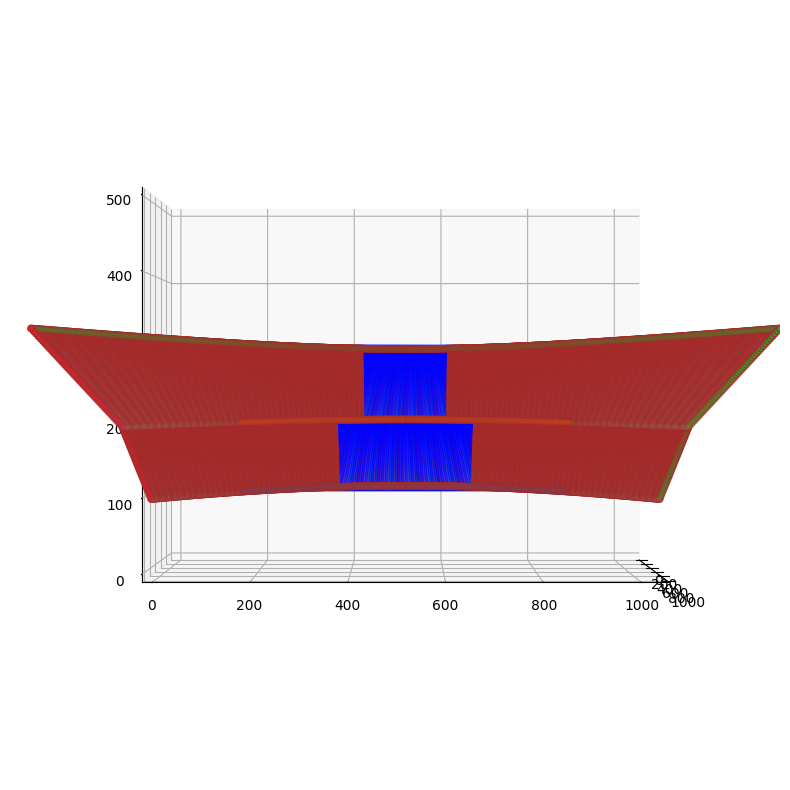
    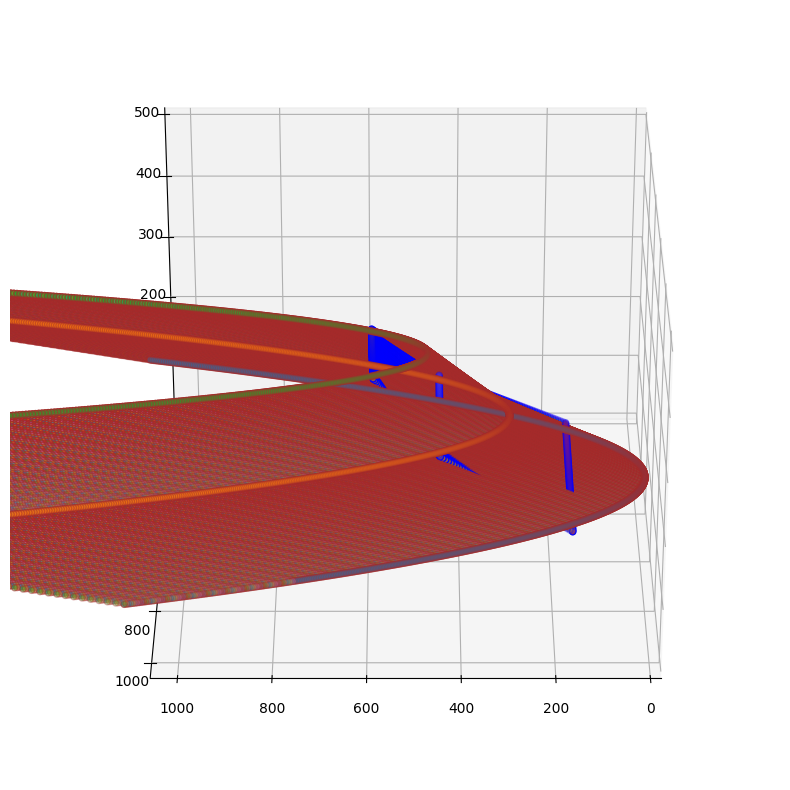
    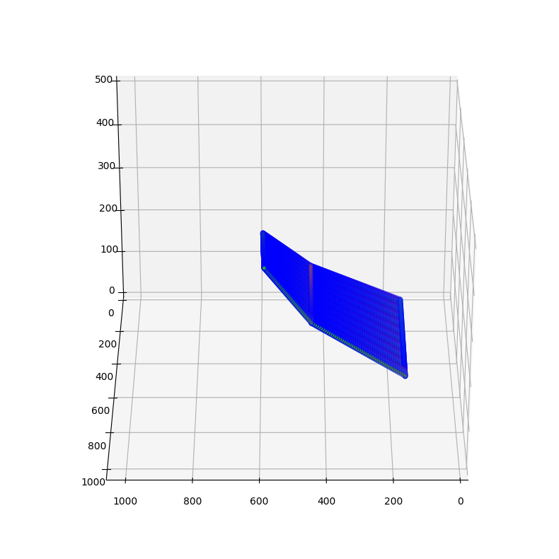
</p>

이렇게 g2의 삼차원 지형은 완성이다. 360도 회전하는 모습을 구경할 시간이다.


### 6) 구현3 - 지질단면도 얻기

삼차원 이미지의 장점은, 내가 원하는 각도나 위치를 마음대로 볼 수 있고, 마음대로 단면을 잘라서 볼 수 있다는 것이다.
단면을 얻는 방법은, 각도를 적당히 회전한 다음, xy평면의 x축과 y축의 범위를 제한하면 손쉽게 얻을 수 있다.
g2를 2023 수능특강에서 가져왔으니, 수능특강에서 제시해준 g2의 지질 단면도를 구해보자.
먼저 수능특강에서 제시한 지질 단면도의 모습이다.

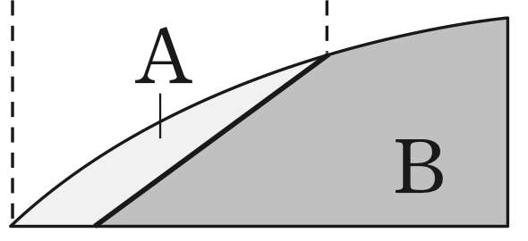

우리의 삼차원 지형을 이 모습에 맞도록 시점을 변화시킨다.

```python
ax.set_ylim([0, 500]) # 단면을 볼 수 있도록 y축의 범위를 제한한다.
ax.view_init(elev=0., azim=-90) # 시점 고도를 0으로, 시점을 -90도 회전시킨다.
```

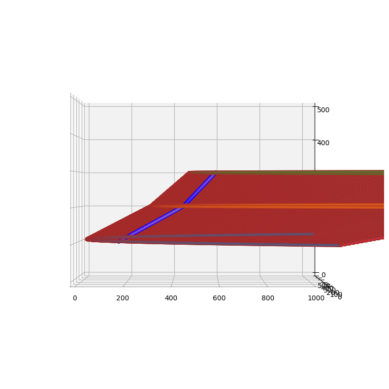

직선으로 그려서 완전히 일치하지는 않지만, 경사의 방향 등은 맞는 것을 알 수 있다.

원하는 각도로 단면을 자르려면 어떻게 해야할까?
우리가 바라보는 직선 시야의 수직인 단면으로 자르면 된다. 그림으로 방법을 알아보자.

각도가 0도일 때 위에서 바라본 상황을 그려보면 아래와 같다.

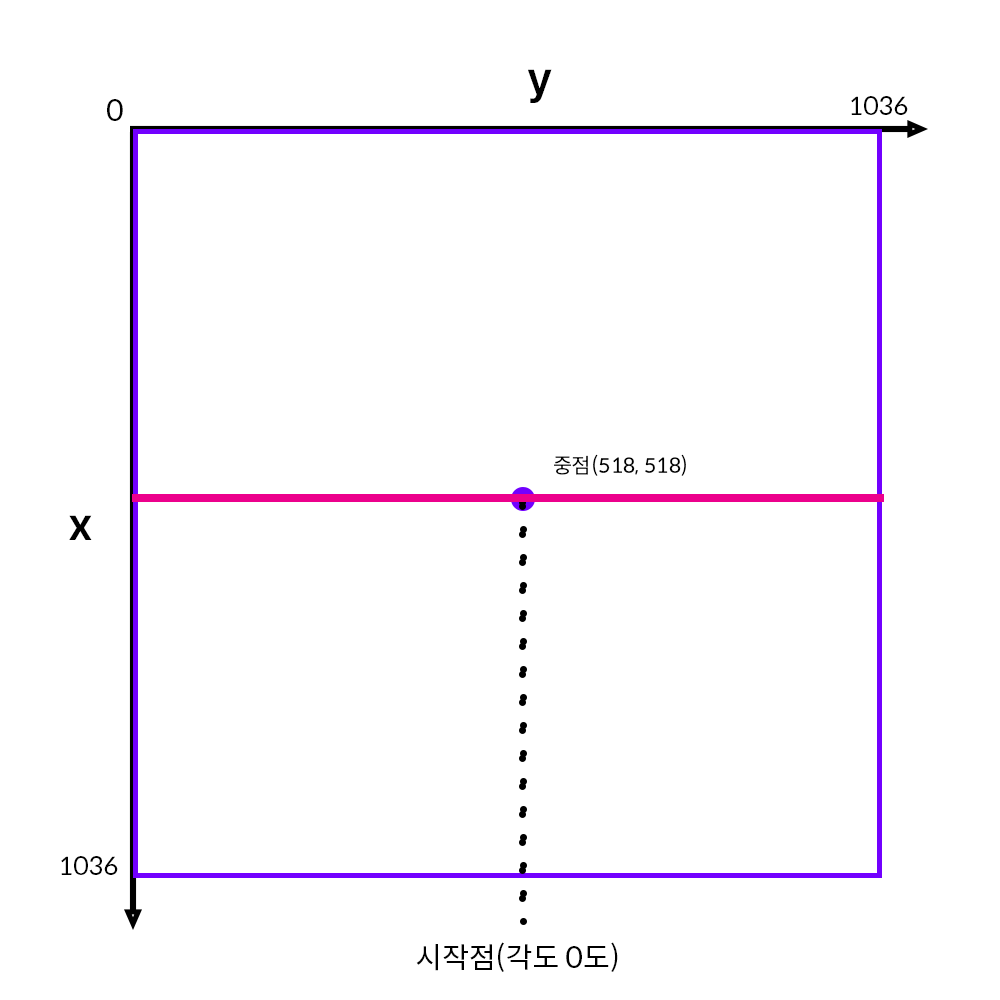

우리가 평소 그리는 x축, y축의 방향이 다름을 유의하자.
고민할 필요 없이, 평면의 중점(xy평면의 크기는 1036x1036이며, 이 때 중점의 크기는 (518, 518)이다)을 지나고, 시점과 수직인 직선을 긋는다. (위 사진의 분홍색 직선)
현 시점 기준으로, 직선 기준으로 하반은 제거하고 상반은 유지한다. (아래 사진)

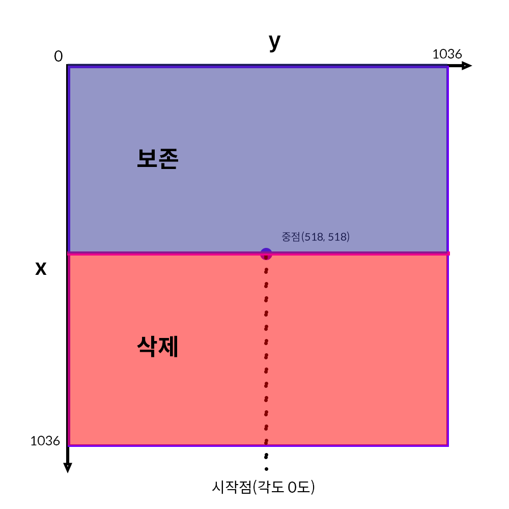

만약 0도가 아니라 임의의 각 a도만큼 시야를 기울인다면?

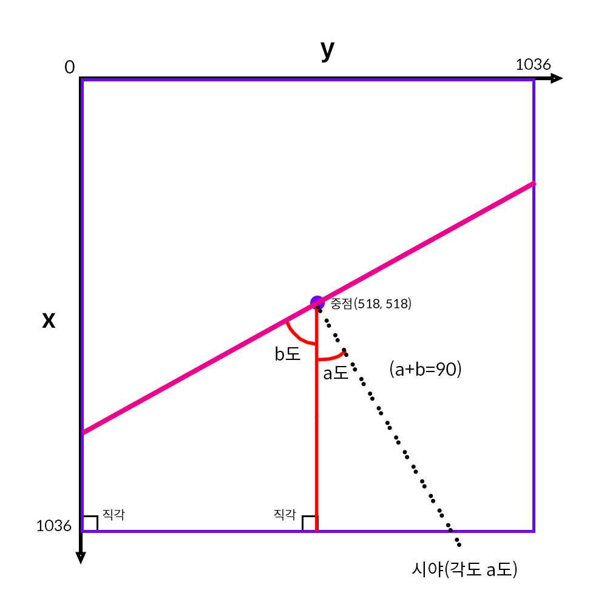

역시 a도의 시야에 수직이고, 중점을 지나는 직선을 긋는다. (위 사진의 분홍색 직선) 
이때 a도와 더해서 90도가 되는 각의 크기를 b도라고 하자.
이때 b도를 포함하는 직각 사다리꼴에는 두 직각이 있으므로, 남은 각의 크기는 (180-b)도다.
a+b=90이므로, (180-b)=90+a다. 

<p align="middle">
	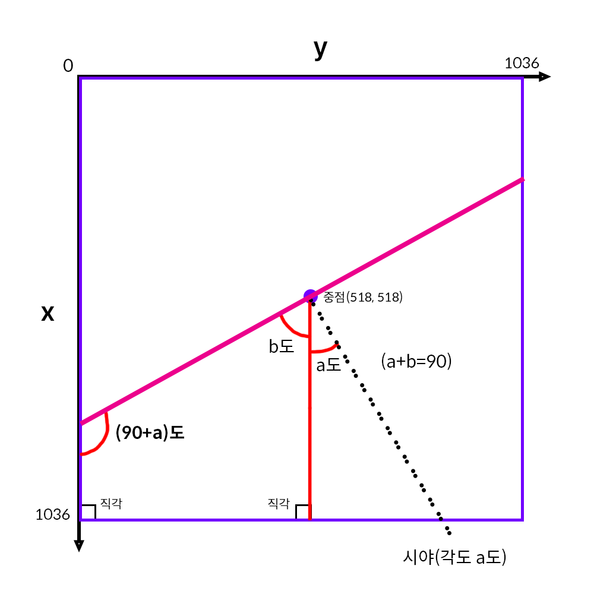
	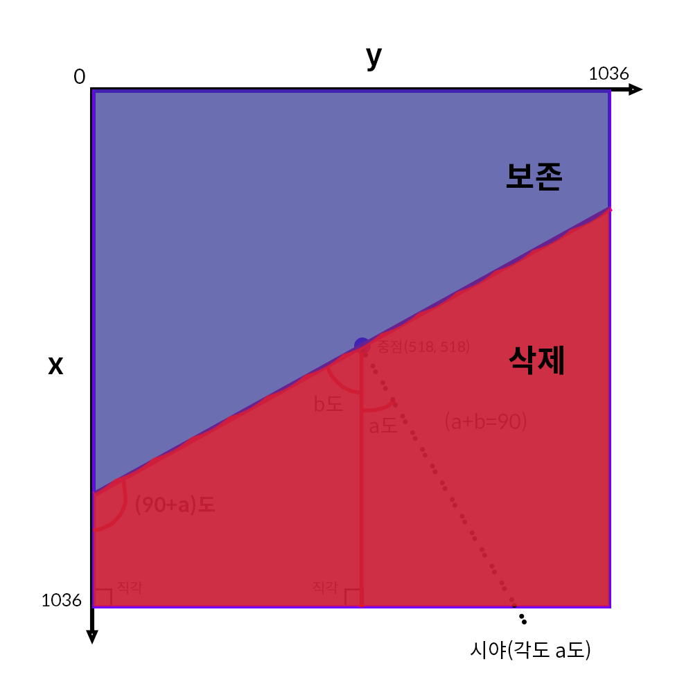
</p>

위 사진과 같은 상황이다. 0도의 경우처럼, a도만큼 기울어진 시야에서 직선 기준으로 하반은 제거하고 상반은 유지한다.

다만, 이때의 직선의 방정식은 어떻게 구할 수 있을까?
직선을 결정하기 위해서는 기울기과 지나는 한 점이 필요하다. 한 점은 평면의 중점이므로, 기울기만 구하면 된다.
직선이 x축의 양의 방향과 이루는 각의 크기가 theta일 때, 직선의 기울기는 tan(theta)이므로,
위 분홍색 직선의 기울기는 tan(90+a)이다.

직선의 방정식을 작성하면 다음과 같다.

```
y = tan(90+a)(x - 518) + 518
```

식을 알았으니 이제 문제는, 어떻게 '하반'들을 제거할 것인가. 이 문제는 numpy로 쉽게 해결할 수 있다.

<details>
<summary>(펼치기) numpy의 마스킹에 대하여</summary>

numpy는 배열 마스킹을 지원한다. 예시로 알아보자.

```python
a = np.array([0, 1, 2, 3, 4])
print(a>3)
# 결과: [False, False, False, False, True]

print(a[a>3])
# 결과: [4]
```

이렇게, 배열의 대괄호 안에 불 값으로 이뤄진 배열을 넣으면(배열과 부등호 등을 이용해 생성할 수 있다) `True`로 표시된 원소만 남고 나머지 원소는 사라진다.

</details>

먼저 직선의 방정식 함수를 반환하는 함수를 만든다.

```python
def line_by_angle(angle):
    def line(X):
        return tan(90+angle) * (X-X_MAX/2)+Y_MAX/2
    return line
```

그 다음, 반환된 함수를 이용해 배열의 원소를 유지하거나 제거한다.

```python
def maskXYZbyAngle(X, Y, Z):
    line = line_by_angle(angle)
    if angle <= 180:
        mask = Y < line(X)
    else:
        mask = Y > line(X)

    return X[mask], Y[mask], Z[mask]
```

`angle`은 각을 담는 전역 변수다. 만약 `angle`의 값이 180보다 크면 직선에 따른 상반과 하반의 위치가 뒤바뀌기 때문에 조건을 분기하였다.
각이 180보다 작거나 같다면 `Y`가 `X`에 따른 직선의 방정식의 함숫값보다 작을 때만 남긴다. 
각이 180보다 크다면 그 반대다.

이제 각도에 따른 단면을 감상해보자!

<p align="middle">
	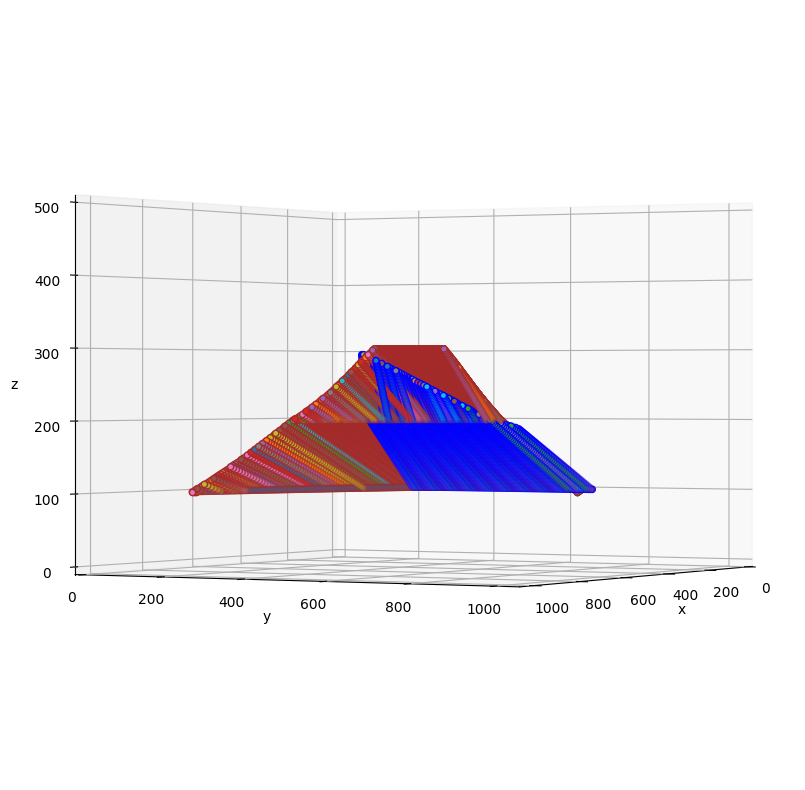
	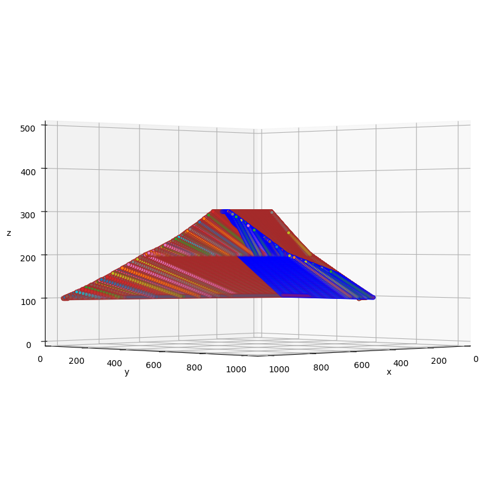
	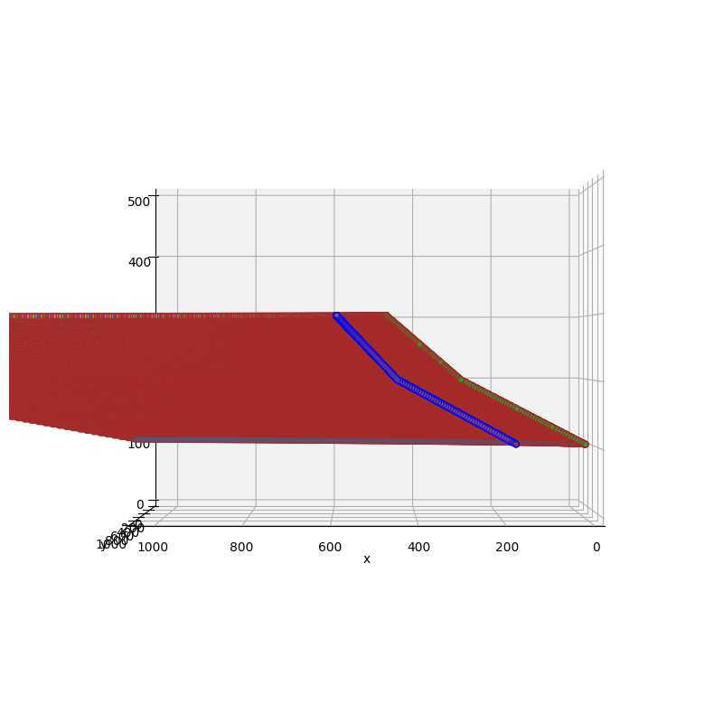
	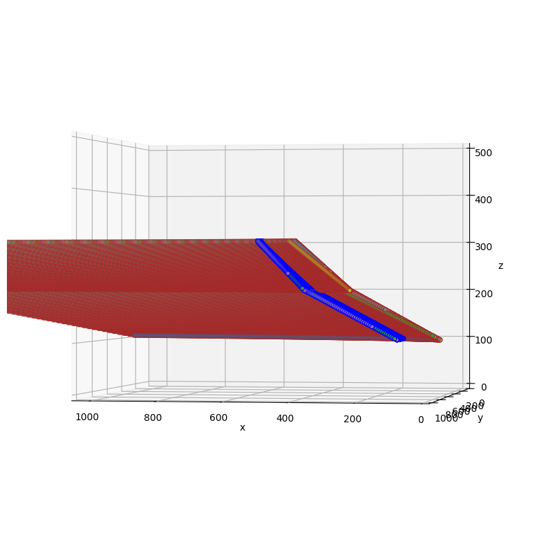
	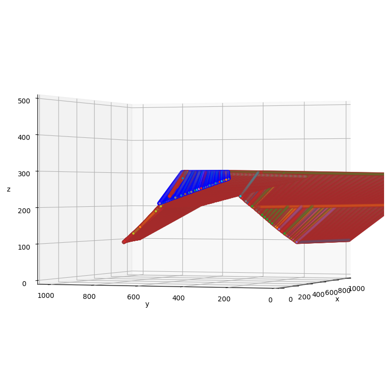
	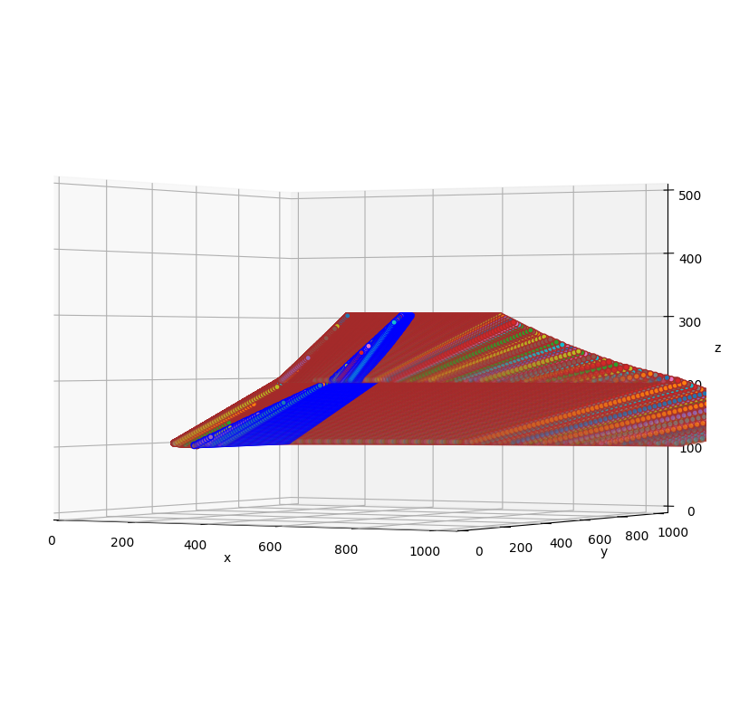
</p>

왼쪽 위에서부터 30도, 45도, 90도, 100도, 200도, 300도다.
gif로 돌려볼까? 


위의 이미지들과는 다르게 한 프레임당 각도만 돌리는 게 아니라 단면을 위해 그림도 다시 그리기 때문에 렌더링 속도가 절망적으로 느려서 
(한 프레임 당 약 10초, 360프레임 = 3600초 = 60분= 1시간...)
멀티 프로세싱을 지원하는 파이썬의 `multiprocessing` 라이브러리로 분산 연산을 한다.
그렇게 20개의 gif 파일을 만든 다음, 하나로 합친다.

## Ⅲ. 느낀 점

지질도 그리는 것에 어려움을 많이 느꼈던 나이기에, 지질도 학습에 도움을 주는 프로젝트를 진행하는 것이 매우 뜻 깊었다.

하지만 어려움도 굉장히 많았던 프로젝트인데, 일단 OpenCV를 처음 다루었는데 원하는 결과가 나오지 않아 중간에 포기해야 했던 것이 마음 아팠고,
plt의 삼차원 공간에 그래프를 그리는 것이 매우 익숙치 않았다. X, Y 뿐만 아니라 Z까지 numpy로 고려해야 하는 삼차원 공간을 다루기 위해서는
알아야 하는 사전 지식이 꽤 많았지만, 멘땅에 해딩하는 식으로 진행했던 나는 자료 조사에 생각보다 큰 시간을 투자해야 했다.

하지만 가장 큰 난관은, gif 파일의 렌더링 시간이었다. 이미지 하나를 추출할 때는 시간이 그리 오래 걸리지 않았다.
그렇게 360장을 만드는 것은 엄청난 시간이 소요된다. 이를 해결하기 위해, 위에서도 썼지만 멀티 프로세싱까지 시도해보았다.
그러나 너무 팬의 소음이 커서 도저히 기숙사에서는 돌릴 수 없어서 지금 느낀 점을 쓰는 중에도 렌더링을 시도하지 못하고 있다.

이렇게 알게 된 것도 많고, 소요된 시간도 정말 길었지만 삼차원 이미지를 구현했다는 점에서 큰 보람을 느낀다. plt와numpy를 다루는 일에는
매우 익숙해져서 어떤 행렬이나 그래프도 그릴 수 있다는 자신감을 얻었다. 

하지만 아직 부족한 점은 많다. 첫째, 등고선 모양을 특정할 때 수동으로 값을 조정해야 한다. 
이를 해결하기 위해서라면 점 3개를 이용해 이차곡선의 연립방정식을 해결하는 등의 방법이 있지만, 이는 '지질도의 삼차원 구현'에서 
크게 벗어나는 것 같아서 시도하지 않았다. 둘째, 산 모양이 매끄럽지 않다. 이는 필자가 수치 조작에 익숙하지 않아서 발생하는 일로,
더 많은 수학적 지식과 삼차원 모델링 지식이 있었더라면 구현했을 것이다. 

이 탐구를 더 개선한다면 위의 문제점을 모두 해결하고, 남들도 쉽게 다룰 수 있게 돕는 GUI를 추가한다면 더욱 뛰어난 
지질도 학습 도구가 될 것이라고 기대한다.

